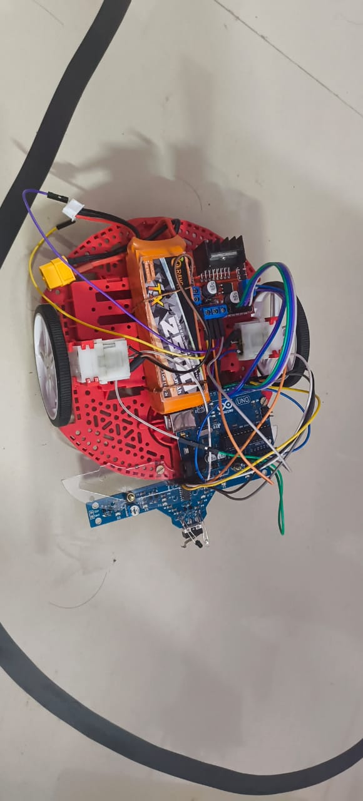

# Line Follower Robot

A Line Follower Robot is an autonomous robot that can follow a predefined path or line, typically a high-contrast line on the ground. 
This project demonstrates how to build and program a simple line follower robot using Arduino.

## Project Overview

This repository includes the following:

- **line_follower.ino**: The Arduino sketch for controlling the line follower robot.
- **Line_follower_robot.jpg**: An image of the line follower robot.
- **line_follwer_cft.jpg**: An image of the circuit diagram or configuration used.

## Features

- Detects and follows a line using infrared sensors.
- Autonomous navigation.
- Simple and efficient design for robotics beginners.

## Requirements

To build and run the line follower robot, you will need:

### Hardware:
- Arduino board (e.g., Arduino Uno)
- Infrared sensors
- Motor driver (e.g., L298N)
- DC motors
- Chassis
- Battery pack
- Connecting wires

### Software:
- Arduino IDE

## Setup and Usage

1. **Hardware Assembly:**
   - Assemble the robot according to the circuit diagram provided in `line_follwer_cft.jpg`.
   - Ensure that the sensors and motors are connected correctly.

2. **Programming the Arduino:**
   - Open `line_follower.ino` in the Arduino IDE.
   - Connect your Arduino board to your computer and upload the sketch.

3. **Testing:**
   - Place the robot on a surface with a clear line to follow.
   - Power on the robot and observe its movement.

## Images

### Robot

### Circuit Diagram

## Contribution - Md Aftab.
                  Suraj Verma.
                  Soumajit Bhattacharjee.

Feel free to fork this repository, make improvements, and submit pull requests.

## License

This project is open-source and available under the [MIT License](LICENSE).

---

Enjoy building your line follower robot and exploring robotics!
